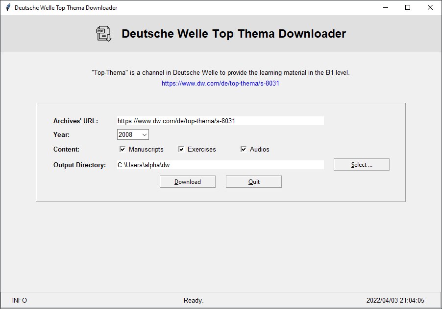

# Deutsche Welle Top-Thema Downloader

## Overview

This project is aimed at developing a tool which can download automatically the **free** ["Top-Thema mit Vokabeln"](https://www.dw.com/de/top-thema/s-8031) resource for **German learning** from the website of Deutsche Welle.

Such free resource includes manuscripts (PDF files) and audio files (MP3).

This project is implemented in **Python** with the PyCharm IDE.

## Related technologies

1. Python
1. GUI via Python's "Tkinter" module
1. HTTP requests via the "Requests" library
1. XML and XPath via the "lxml" library
1. Multi-threading via Python's "threading" module
1. JSON

## Difficulties

1. The structure of the articles' web pages has changed twice since 2008. One change happened on 2016.07.12 and the other, on 2021.01.01.
1. Some implicit changes happened in the articles' web pages since 2014. For example, the link to the audio file can only be found in extra web pages before 2014. But it can be parsed from a hidden "input" element since 2014.
1. There are some errors with the web pages in the Top-Thema channel. This application has to handle those errors.

## Copyrights

All copyrights reserved.
